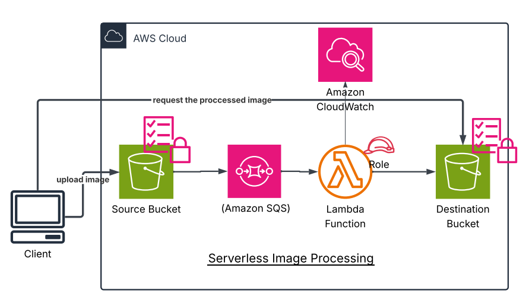

# 🖼️ Serverless Image Processing Pipeline

This project implements a **serverless image processing pipeline** using AWS services. It enables users to upload images, automatically processes them (e.g., resizing, watermarking), and stores the results for public retrieval — all without managing servers.

## 🏗️ Architecture Overview

- **Amazon S3 (Source Bucket)**: Stores raw uploaded images.
- **Amazon SQS**: Decouples image upload from processing for reliability and scalability.
- **AWS Lambda**: Processes the image using Python and Pillow.
- **Amazon S3 (Destination Bucket)**: Stores the processed image for retrieval.
- **Amazon CloudWatch**: Logs all Lambda executions and metrics.

> 

## 🔁 Workflow

1. User uploads an image to the **Source S3 Bucket**.
2. The upload triggers an S3 event and sends a message to **SQS**.
3. A **Lambda** function processes the image:
   - Downloads it from S3
   - Resizes or modifies it
   - Uploads the result to the **Destination S3 Bucket**
4. **CloudWatch** monitors all Lambda activity.
5. Users retrieve the processed image publicly via HTTP(S).

## 🧠 Lambda Function Details

- **Runtime**: Python 3.10
- **Libraries**: `boto3`, `Pillow`
- **Trigger**: `PutObject` event on Source Bucket
- **IAM Role**: Scoped access to S3 and SQS

### 📦 Sample Lambda Code

```python
import boto3
from PIL import Image
import io

s3 = boto3.client('s3')

def lambda_handler(event, context):
    source_bucket = event['Records'][0]['s3']['bucket']['name']
    source_key = event['Records'][0]['s3']['object']['key']
    destination_bucket = 'destination-bucket-name'

    response = s3.get_object(Bucket=source_bucket, Key=source_key)
    image_content = response['Body'].read()
    image = Image.open(io.BytesIO(image_content))

    image = image.resize((300, 300))  # Resize to 300x300

    buffer = io.BytesIO()
    image.save(buffer, format="JPEG")
    buffer.seek(0)

    destination_key = f"processed/{source_key}"
    s3.put_object(Bucket=destination_bucket, Key=destination_key, Body=buffer, ContentType='image/jpeg')

    return {
        'statusCode': 200,
        'body': f'Image processed and uploaded to {destination_key}'
    }
